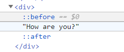
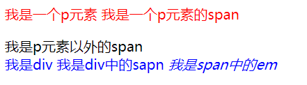

# CSS3 (Ⅰ)

> 提要：
>
> - CSS3 的导入方式
> - CSS3 的三种基本选择器
> - CSS3 的其他常用选择器
> - 字体/文本样式的相关设置
> - 其他杂项

## CSS 简介

### 网页的构成要素

- 结构（HTML）
- 表现（CSS）
- 行为/交互（Javascript）

### CSS

层叠样式表

网页实际上是一个多层的结构，通过 CSS 可以分别为网页的每一各层设置样式，而最终我们可以看到只是网页的最上面一层

CSS 用于设置网页中的元素样式

### 使用 CSS 修改元素样式

- 通过内联标签的方法设置（行内样式，优先级最高）

```html
<p style="color: blue; font-size: 30px;">你好</p>
```

- 将样式编写到 head 标签中的 style 标签里，然后通过 CSS 选择器来选中元素并为其设置各种样式，可以同时未多个标签设置样式，修改时修改一处就可以全部应用，但是内部样式表只可以对一个网页起作用，它里面的样式不可以对其它页面进行复用

```css
p {
	color: green;
	font-size: 20px;
	font-style: underline;
 /*必须遵循css的语法规则，不要用html的语法*/
}
```

## CSS 基本语法

### 基本语法

选择器后跟声明块

选择器：通过选择器可以选中页面中的指定元素

例如 p 的作用就是选中页面中的所有 p 元素

声明块：通过声明块指定要为元素设置的样式，声明块有一个个的声明组成，声明是一个名值对结构：一个样式名对应一个样式值，名和值之间用:链接，以;结尾

```css
p {
	color: lightcoral;
	font-size: 40px;
}
h1 {
	color: rgba(23, 167, 124, 0.733);
}
body {
	background-color: lightyellow;
}
```

### 补充 CSS 的几个常用的样式设置

```css
float: left;
display: block;
height: 50px;
width: 50px;
border-radius: 10px;
background-color: aqua;
text-align: center;
color: red;
text-decoration: none;
margin-right: 5px;
font: bold 20px/50px Arial;
```

## CSS 选择器

### 标签选择器

```css
p {
	color: red;
}
```

### 类 class 选择器

> class 是一个标签的属性，和 id 类似，不同的是 class 可以进行复用，而 id 是唯一的
>
> 一个标签可以有多个类属性名，用空格分隔
>
> ```html
> <p class="blue abc"></p>
> ```

语法：`.class`属性值

```css
.blue {
	color: blue;
}
```

### id 选择器

作用：根据元素的 id 属性选中一个元素

语法：`#id`属性值

```css
#abc {
	background-color: aqua;
	color: red;
}
```

### 选择器的复合使用

#### 交集选择器

> 交集选择器：选中同时符合多个条件的元素
>
> 语法：选择器 1 选择器 2 选择器 3 选择器 n{}
>
> ```html
> <div class="red">我是div</div>
> <div class="red2 a b c">我是div</div>
> ```

```css
div.red {
	font-size: 30px;
}
div.red2.a.b.c {
	color: green;
}
```

#### 并集选择器

> 选择器分组（并集选择器）
>
> 作用：同时选择多个选择器对应的元素，用逗号进行分割
>
> 语法：选择器 1,选择器 2,选择器 n{}

```css
h1,
span {
	font-size: 40px;
}
```

## CSS 中的字体单位

- 像素：

屏幕（显示器）：实际上是由一个一个的小点构成

不同屏幕的像素大小不同，像素越小的阿屏幕显示的效果越清晰

同样的 200 像素，在不同的设备下显示效果不一样

- 百分比：

也可以将属性值设置为属性相对于其父元素的百分比。em 是相对于元素字体大小来计算的。`1em = 1 * font-size`，em 会根据字体大小的改变而改变

- rem 相对于根元素（HTML 字体元素）

## CSS 的其他选择器

### 关系选择器

> 关系合集
>
> - 父元素
>
> 直接包含子元素的元素叫做父元素
>
> - 子元素
>
> 直接被父元素包含的元素
>
> - 祖先元素
>
> 直接或间接包含后代元素的元素叫做祖先元素
>
> **一个元素的父元素也是它的祖先元素**
>
> - 后代元素
>
> 相对于祖先元素的概念，这里不再赘述
>
> - 兄弟元素
>
> 拥有相同的父元素的元素

#### 子元素选择器

子元素选择器：选中指定父元素的指定子元素

格式：父元素 > 子元素 > 子元素

```css
div.box > span {
	color: green;
}
```

#### 后代元素选择器

作用：选中指定元素内的指定后代元素

语法：祖先 后代（用空格分隔）

```css
div span {
	color: skyblue;
}
```

#### 兄弟元素选择器

选择下一个兄弟元素

 前一个 + 下一个

选择下一个所有的兄弟元素

 兄 ~ 弟

```css
p + span {
	color: blue;
}
p ~ span {
	color: green;
}
```

### 属性选择器的使用

> 结合正则表达式理解

```html
<!DOCTYPE html>
<html lang="en">
	<head>
		<meta charset="UTF-8" />
		<meta name="viewport" content="width=device-width, initial-scale=1.0" />
		<title>Document</title>
	</head>
	<style>
		/*
        属性选择器：
        [属性名]选择含有指定属性的元素
        [属性名=属性值]选择含有指定属性和指定值的元素
        [属性名^=属性值]选择属性值以指定值开头的元素
        [属性名$=属性值]选择属性值以指定值结尾的元素
        [属性名*=属性值]选择属性值含有指定值的元素
        */
		p[title] {
			color: green;
		}
		p[title="abc"] {
			color: orange;
		}
		p[title^="abc"] {
			color: blue;
		}
		p[title$="abc"] {
			color: red;
		}
		p[title*="abc"] {
			color: lightgreen;
		}
	</style>
	<body>
		<h1>我是标题</h1>
		<p title="abc">少小离家老大回</p>
		<p title="abc">乡音无改鬓毛催</p>
		<p title="abcdef">儿童相见不相识</p>
		<p title="abc">笑问客从何处来</p>
		<p title="ssabc">落霞与孤鹜齐飞</p>
		<p title="helloabc">秋水共长天一色</p>
	</body>
</html>
```

### 伪类选择器

```html
<!DOCTYPE html>
<html lang="en">
	<head>
		<meta charset="UTF-8" />
		<meta name="viewport" content="width=device-width, initial-scale=1.0" />
		<title>Document</title>
	</head>
	<style>
		/* 将ul里的第一个li设置为红色 */

		/* 伪类：用来描述一个元素的特殊状态：
            第一个子元素、被点击的元素，鼠标移入的元素……
            伪类一般情况下使用冒号开头
            :first-child 第一个子元素
            :last-child 最后一个子元素
            :nth-child(n)选中第n个子元素，n取非负整数：0，1，2……
                也可以直接传入特殊参数
                2n 表示选中偶数位的元素 或者传入even
                2n+1 奇数位的元素 或者传入odd

            以上这些伪类都是根据所有的子元素进行排序并进行判断，也即选中指定顺序的元素，并且该元素是要求的元素样式才会生效

            :first-of-type
            :last-of-type
            :nth-last-of-type()
            以上几个伪类和上述的类似，不同点是他们在同类型的元素中排序
        */

		ul > li:first-child {
			color: red;
		}
		ul > li:last-child {
			color: green;
		}
		ul > li:nth-child(3) {
			color: yellowgreen;
		}
		/* :not()否定伪类
                将符合条件的元素从选择器中去除，常作为复合选择器中的某一个部分 */

		ul > li:not(:nth-last-of-type(3)) {
			color: blue;
		}
	</style>
	<body>
		<ul>
			<span>我是一个span</span>
			<li>第零个</li>
			<li>第一个</li>
			<li>第二个</li>
			<li>第三个</li>
   <li>第四个</li>
			<li>第五个</li>
			<li>第末个</li>
		</ul>
	</body>
</html>

```

> 这里需要注意的是，
>
> `:nth-of-type(n)`这一伪类选择器是针对具有一组兄弟节点的标签, 用 n 来筛选出在一组兄弟节点的位置
>
> `:nth-child(n)`这一伪类选择器首先找到所有当前元素的兄弟元素，用n来筛选出当前元素的兄弟元素节点的位置。
>
> 可以注意到:**nth-of-type他是当前元素的兄弟元素的第n个，而nth-child是当前元素的兄弟节点的第n个当前元素**
>
> **nth-of-type是取当前元素的兄弟元素的第n个，nth-child取的是当前元素的第n个节点的当前元素，需要进行标签元素的类型判断**


### 伪元素选择器

> 伪元素：表示页面中的一些特殊的，并不真实存在的元素

伪元素使用::开头

- ` ::first-letter` 表示第一个字母

- ` ::first-line` 表示第一行

- ` ::selection` 表示选中的内容



- `::before` 元素的开始位置，必须结合 content 属性使用

- `::after` 元素的结束位置，必须结合 content 属性使用

 两者很常用！实现了使用 css 添加内容

## 选择器的权重

样式冲突：当我们通过不同的选择器选中相同的元素，并且为相同的样式设置不同的值，此时就发生了样式冲突，注意最终显示的样式效果和位置无关

 发生样式冲突时，应用哪个样式由选择器的权重决定

| 选择器                                  | 权重值           |
| --------------------------------------- | ---------------- |
| 直接在标签内部写入 style 属性的内联样式 | 1 0 0 0          |
| id 选择样式                             | 0 1 0 0          |
| 类和伪类选择器                          | 0 0 1 0          |
| 元素选择器                              | 0 0 0 1          |
| 通配选择器                              | 0 0 0 0          |
| 继承样式                                | 没有优先级的概念 |

 比较优先级时，需要将所有的选择器的优先级进行相加运算，最有优先级越高，则越优先显示（分组选择器单独计算）

 选择器的累加不会超过其最大的数量级，例如类选择器叠加值永远小于 id 选择器

 如果优先级相同，此时则优先使用靠下的样式

 可以在样式的后面添加!important 则此时此样式会超过所有的选择器优先级，甚至包括内联样式，但是尽量不要在实际的开发中使用

总之：**越细节/精确的选择器限制优先级越高，同精确的选择器限制时采用就近原则**

id > class > tag

## 样式的继承

> 样式的继承：为一个元素设置的样式同时也会应用到它的后代元素上

继承是发生在祖先后代之上的

继承的设计是为了方便我们进行开发，利用继承可以将一些通用的样式统一设置到共同的祖先元素上，这样只需要设置一次就可以让所有的元素都具有该样式

不是所有的样式都会被继承，比如背景相关的（默认为透明颜色），布局相关等的这些样式都不会被继承，但是从效果上可能会存在覆盖的效果

```html
<style>
		p {
			color: red;
		}
		div {
			color: blue;
		}
	</style>
	<body>
		<p>
			我是一个p元素
			<span>我是一个p元素的span</span>
		</p>
		<span>我是p元素以外的span</span>
		<div>
			我是div
			<span>
				我是div中的sapn
				<em>我是span中的em</em>
			</span>
		</div>
	</body>
```



## 内容样式

> （字体、文本、颜色）

### 颜色

> 在CSS中可以直接使用颜色名设置各种颜色

- 颜色名直接进行使用
- RGB：三原色（Red、Blue、Green）调配颜色
          - 每一种颜色的范围：0~255（0% - 100%）
                  语法：RGB(红色、蓝色、绿色)
- RGBA
          在RGB的基础上增设了一个a参数表示不透明度
          a在0~1之间，1表示完全不透明，0表示完全透明，0.5半透明
- 十六进制RGB
          语法：#红色绿色蓝色（十六进制）
          颜色浓度00~ff调整
          颜色两位重复可以进行简写
    -  HSL值
        H 色相 0~360
        S 浓度
        L 亮度

### 字体样式

| 属性        | 说明     |
| :---------- | :------- |
| font-family | 字体类型 |
| font-size   | 字体大小 |
| font-weight | 字体粗细 |
| font-style  | 字体风格 |
| color       | 字体颜色 |

### 文本样式

| 属性            | 说明       |
| :-------------- | :--------- |
| text-indent     | 首行缩进   |
| text-align      | 水平对齐   |
| text-decoration | 文本修饰   |
| text-transform  | 大小写转换 |
| line-height     | 行高       |

#### 文本对齐 text-align

text-align属性取值有3个，如下表所示。

| 属性值 | 说明             |
| :----- | :--------------- |
| left   | 左对齐（默认值） |
| center | 居中对齐         |
| right  | 右对齐           |

在实际开发中，我们只会用到居中对齐（center）这一个，其他两个几乎用不上。此外，text-align属性不仅对文本有效，对图片（img元素）也有效。对于图片水平对齐，我们在后面会详细介绍。

#### 文本首行缩进 text-indent

中文段落首行一般需要缩进两个字的空间。如果想要实现这个效果，text-indent值应该是font-size值的2倍。

#### 文本行高调整 line-height

在CSS中，我们可以使用line-height属性来控制一行文本的高度（注意不要和行间距混为一谈）

#### 文本装饰 text-decoration

text-decoration属性取值有4个，如下表所示。

| 属性值       | 说明                         |
| :----------- | :--------------------------- |
| none         | 去除所有的划线效果（默认值） |
| underline    | 下划线                       |
| line-through | 中划线                       |
| overline     | 顶划线                       |

在HTML学习中，我们使用s元素实现中划线，用u元素实现下划线。但是有了CSS之后，我们都是用text-decoration属性来实现。

在前端开发中，对于外观控制一般用CSS来实现，而不是使用标签来实现，这更加符合结构与样式分离的原则，提高可读性和可维护性。

#### 代码示例

```html
<!DOCTYPE html>
<html lang="en">
	<head>
		<meta charset="UTF-8" />
		<meta http-equiv="X-UA-Compatible" content="IE=edge" />
		<meta name="viewport" content="width=device-width, initial-scale=1.0" />
		<title>Document</title>
	</head>
	<style>
		h1 {
			text-align: center;
			color: rgba(10, 171, 171, 0.755);
		}
		p {
			color: royalblue;
			text-indent: 2em;
			/* 首行缩进 2em */
			font-family: "Times New Roman", Times, serif;
			font-size: 20px;
		}
		.text1 {
			color: brown;
			background-color: antiquewhite;
			text-decoration: line-through;
		}
		.text2 {
			background: yellow;
			height: 100px;
			line-height: 100px; /*设置行高与块元素高度相同,实现上下居中*/
			text-decoration: underline;
		}
		.text3 {
			text-decoration: overline;
		}
    p>span{
      color:rebeccapurple;
      vertical-align:75px;
    }
    ::selection{
      color: aqua;
      background-color: blue;
    }
	</style>
	<body>
		<h1>Hello World</h1>
		<p class="text1">
			Lorem ipsum dolor sit amet, consectetur adipisicing elit. Ab illo aut enim
			aliquid pariatur repellat blanditiis architecto illum eligendi
			voluptatibus, quos beatae corporis nam deserunt quae, laboriosam non
			corrupti ex!
		</p>
		<p class="text2">Hello World</p>
		<p class="text3">Hello World?</p>
		<p>
			
      <span>Hello World</span>
		</p>
	</body>
</html>

```

### 文本阴影和超链接伪类（CSS3）

```html
<!DOCTYPE html>
<html lang="en">
	<head>
		<meta charset="UTF-8" />
		<meta name="viewport" content="width=device-width, initial-scale=1.0" />
		<title>Document</title>
		<style>
            /*
                利用伪类进行处理
                :link表示没有访问过的链接(正常的链接)
               :visited表示访问过的链接，仅能修改字体颜色
            */
			a:link {
                color: #3c0303;
                font-size: 50px;
			}

			a:visited {
                font-size: 50px; /*通常这样的操作是无效的，因为要保护用户隐私*/
				color: orange;
			}
			/* :hover 用来表示鼠标移入的状态 :active 用来表示鼠标点击 */
			a:hover{
				color: red;
			}
			a:active{
				color: blueviolet;
				font-size: 70px;
			}
		</style>

	</head>
	<body>
		<!--
        1.没有访问过的链接
        2.已经访问过的链接
     -->
		<a href="https://www.baidu.com">Baidu_已经访问</a>
		<br /><br />
		<br><br>
		<a href="https://www.hao123.com">Hao123未访问</a>
		<a href="https://www.hao123.com">Hao123_未访问</a>
	</body>
</html>
```

## 列表样式

在CSS中，不管是有序列表还是无序列表，我们都是使用list-style-type属性来定义列表项符号。

list-style-type属性是针对ol或者ul元素的，而不是li元素。其中，list-style-type属性取值如下表所示。

| 属性值      | 说明                           |
| :---------- | :----------------------------- |
| decimal     | 阿拉伯数字：1、2、3…（默认值） |
| lower-roman | 小写罗马数字：i、ii、iii…      |
| upper-roman | 大写罗马数字：I、II、III…      |
| lower-alpha | 小写英文字母：a、b、c…         |
| upper-alpha | 大写英文字母：A、B、C…         |

| 属性值 | 说明              |
| :----- | :---------------- |
| disc   | 实心圆●（默认值） |
| circle | 空心圆○           |
| square | 正方形■           |

上面的都不用记，只是列举一下

**最常用的是去掉默认的列表样式**

```css
list-style-type: none;
```

使用list-style-type:none这个小技巧可以去除列表项默认的符号，在实际开发中，我们经常会用到。

`ol,ul{list-style-type:none;}`使用的是“群组选择器”。当对多个不同元素定义了相同的CSS样式时，我们就可以使用群组选择器。在群组选择器中，元素之间是用英文逗号隔开的，而不是中文逗号。

除此以外，列表项图片也用于设置列表样式

在CSS中，我们可以使用list-style-image属性来定义列表项图片，也就是使用图片来代替列表项符号。

```css
list-style-image: url(图片路径);
```

## 表格样式

### 表格标题

在CSS中，我们可以使用caption-side属性来定义表格标题的位置。

| 属性值 | 说明                 |
| :----- | :------------------- |
| top    | 标题在顶部（默认值） |
| bottom | 标题在底部           |

### 表格边框距离调整

从前面的学习中可以知道，表格加入边框后的页面效果中，单元格之间是有一定空隙的。但是在实际开发中，为了让表格更加美观，我们都是要把单元格之间的空隙去除。

在CSS中，我们可以使用border-collapse属性来去除单元格之间的空隙，也就是将两条边框合并为一条。

border-collapse属性取值只有2个，如下表所示 。

| 属性值   | 说明                       |
| :------- | :------------------------- |
| separate | 边框分开，有空隙（默认值） |
| collapse | 边框合并，无空隙           |

同时，我们也可以具体调整边框之间的距离

在CSS中，我们可以使用border-spacing属性来定义表格边框间距。在CSS中，border-spacing属性也是在table元素中定义的。

## 图片样式

### 图片大小

- 使用PS直接制作相应大小的图片
- 使用width、height调整元素大小

### 图片的对齐方式

水平方式和文本样式相同 我们可以使用text-align属性来定义图片水平对齐方式。

> text-align属性一般只用于两个地方：文本水平对齐和图片水平对齐。

> 垂直对齐：暂略 
>
> vertical-align属性定义周围的行内元素或文本相对于该元素的垂直方式 ，这里暂不分析

## 背景样式

### 背景样式简介

在CSS中，背景样式包括两个方面：背景颜色和背景图片。

### 背景颜色

在CSS中，定义“背景颜色”使用的是background-color属性

### 背景图片样式

| 属性                  | 说明                                     |
| :-------------------- | :--------------------------------------- |
| background-image      | 定义背景图片地址                         |
| background-repeat     | 定义背景图片重复，例如横向重复、纵向重复 |
| background-position   | 定义背景图片位置                         |
| background-attachment | 定义背景图片固定                         |

#### 背景图片地址

`background-image: url(图片路径);`

#### 背景图片重复

background-repeat属性取值有4个，如下表所示。

| 属性值    | 说明                                     |
| :-------- | :--------------------------------------- |
| repeat    | 在水平方向和垂直方向上同时平铺（默认值） |
| repeat-x  | 只在水平方向（x轴）上平铺                |
| repeat-y  | 只在垂直方向（y轴）上平铺                |
| no-repeat | 不平铺                                   |

#### 背景图片定位

在CSS中，我们可以使用background-position属性来定义背景图片的位置。

background-position属性常用取值有两种：一种是“像素值”；另外一种是“关键字”（这里不考虑百分比取值）。

##### 像素值定位

当background-position属性取值为“像素值”时，要同时设置水平方向和垂直方向的数值。

background-position属性设置的两个值是相对该元素的左上角来说的

水平距离和垂直距离这两个数值之间要用空格隔开，两者取值都是像素值。

##### 关键字定位

| 属性值        | 说明     |
| :------------ | :------- |
| top left      | 左上     |
| top center    | 靠上居中 |
| top right     | 右上     |
| center left   | 居中靠左 |
| center center | 正中     |
| center right  | 居中靠右 |
| bottom left   | 左下     |
| bottom center | 靠下居中 |
| bottom right  | 右下     |

在实际开发中，background-position一般用于实现CSS Spirit（精灵图片）

#### 样式简写

如需缩短代码，也可以在一个属性中指定所有背景属性。它被称为简写属性。

```css
body {
  background-color: #ffffff;
  background-image: url("tree.png");
  background-repeat: no-repeat;
  background-position: right top;
}
```

使用简写属性在一条声明中设置背景属性：

```css
body {
  background: #ffffff url("tree.png") no-repeat right top;
}
```

## 鼠标样式

在CSS中，我们可以使用cursor属性来定义鼠标样式。

在实际开发中我们一般只会用到3个：default、pointer和text

也可以自定义鼠标样式

除了使用浏览器自带的鼠标样式，我们还可以使用cursor属性来自定义鼠标样式。只不过语法稍微有点不一样。

```css
cursor: url(图片地址), 属性值;
```

说明：

这个“图片地址”是鼠标图片地址，其中鼠标图片后缀名一般都是.cur，我们可以使用Photoshop来制作
