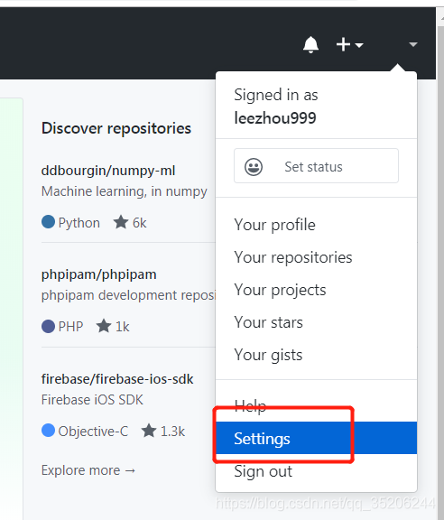
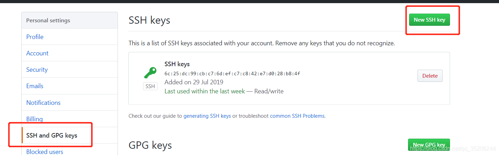
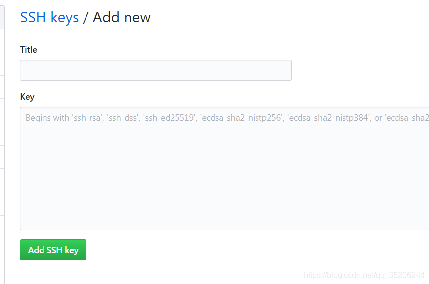

# Git 与 Github 的使用

> 这里记录下 Git 的控制台的使用方法，主要是 VSCode/WebStorm 自带的 Git 插件不方便添加代理（Proxy）
>
> 主要记录 Git 与 Github 之间的 ssh 通信，Git 本地的细节操作暂时不写

## Git 终端设置代理

> 默认设置代理端口为 1080，下次使用时直接赋值即可

```bash
git config --global https.proxy http://127.0.0.1:4500
git config --global https.proxy https://127.0.0.1:4500
git config --global --unset http.proxy
git config --global --unset https.proxy
npm config delete proxy
git config --global http.proxy 'socks5://127.0.0.1:4500'
git config --global https.proxy 'socks5://127.0.0.1:4500'
```

## 本地 Git 仓库操作

- 使用`git init`命令，创建新的仓库（可以使用 VSCode 插件完成）

- 一次性提交所有更改的代码到暂存区

```bash
git add .
```

- 提交

```bash
git commit -m "message"
```

## Git Bash 生成 SSH

```bash
ssh-keygen -t rsa -C "自己的邮箱"
```

SSH 文件存放在 C:/User/用户/.ssh 下，id_rsa 为私钥，id_rsa.pub 为公钥。

打开 id_rsa.pub 文件，全选，复制全文

`github->账户->setting`



选择 SSH and GPGkeys，New SSH key



自定义一个 title，然后粘贴从公钥文件中拷贝的 key



测试链接

```bash
ssh -T git@github.com
```

## 推送文件到远程

**建议**，在远程建立好仓库，本地进行 clone，然后再添加新文件，最后推送至远程。这样的步骤对新手比较友好。

> 如：事先在 github 建立了仓库，bysj，并新建了 README 文件，此时远程仓库中只有这一个文件。

### 总结：如何推送文件至远程？

① 建立本地仓库
② 与远程建立连接，测试
