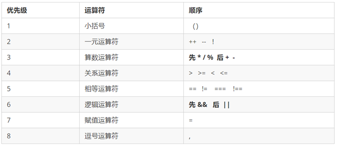

# JavaScript（1）

> 提要：
>
> - JavaScript 基础概念、基本语法
> - JavaScript 运算符、变量类型
> - JavaScript 基本程序设计
> - JavaScript 数组
> - JavaScript 函数
> - JavaScript 的运行机制

## 背景

JavaScript 是运行在浏览器上的脚本语言，简称 JS

Javascript 是 NetScape 公司的布兰登艾奇开发的，最初叫做 Livescript

## JavaScript 特点

- 解释性语言
  - JavaScript 不需要程序员手动编译，编写完源代码之后，浏览器**直接打开解释执行**
  - JavaScript 的“目标程序”以普通文本形式保存，称作为脚本语言
- 类似于 C 和 Java 的语法结构
- 动态语言
- 基于原型的 OOP

## 浏览器执行 JS

浏览器分为两个部分

- 渲染引擎
- JS 引擎（JS 解释器）执行代码

逐行进行解释，然后由计算机执行（脚本语言）

## JS 的组成

- ECMAScript（现为 ES6 标准）（Javascript 语法）
- DOM（文档对象模型）（API 部分）
- BOM（浏览器对象模型）

## JS 的导入方式

```html
<!DOCTYPE html>
<html lang="en">
	<head>
		<meta charset="UTF-8" />
		<meta http-equiv="X-UA-Compatible" content="IE=edge" />
		<meta name="viewport" content="width=device-width, initial-scale=1.0" />
		<title>Document</title>
	</head>
	<!-- 内嵌式与外部引入 -->
	<script src="HelloWorld.js">
		// alert('Hello World');
	</script>
	<body>
		<!-- 行内式 直接写入元素内部-->
		<input type="button" value="Hello" onclick="alert('Hello World!')" />
	</body>
</html>
```

- 行内式
- 内嵌式
- 外部引入

## JS 的输入输出

- alert
- console.log
- prompt

```html
<script>
	/* 输入框，输入函数，返回值为输入的内容，是一个字符型变量 */
	prompt("请输入年龄");
	/* 输出框，展示给用户 */
	alert("计算的结果是");
	/* 控制台输出 */
	console.log("Hello World");
</script>
```

## JS 基本语法

JS 变量需要先定义后使用

### 变量声明、赋值与初始化

```javascript
var age; //声明变量
let age;
const age;
age = 10; //变量赋值
alert(age);
var age = 18;
var name = "John";
```

> 在 ES6 中建议使用 let 或者是 const，减少 var 的使用
>
> 变量只声明不赋值，输出为 undefined

### 简单数据类型简介

- JS 变量的数据类型取决于变量最后的赋值
- JS 是动态语言，变量的数据类型可以随时变化
- `typeof()`**表示输出变量的数据类型**

> 简单数据类型

- Number 数字型

  - 不同进制的写法：程序中数字前面加 0，表示八进制；数字前加 0x，表示十六进制

  - 数字中的最大值

    - `Number.MAX_VALUE` 表示输出 Number 型的最大值

  - 特殊值

    - ±Infinity 表示无穷大
    - NaN 表示非数字

  - `isNaN()`方法

    - 用来判断是否为数字，并且返回一个布尔值

    - ```javascript
      console.log(isNaN(12)); //返回false
      ```

- Boolean

  - true
  - false

- String

  - 建议使用单引号对定义字符串

  - 字符串中也可以使用转义字符，例如\n `\\ \' \" \t \b`等 ,转义字符要写在引号里面

  - 字符串的`length()`方法可以检测获取字符串的长度

  - ```
    var strMsg = 'Hello World';
    alert(strMsg.length());
    ```

  - 字符串拼接：**使用+** 只要有字符串和其他类型拼接，最终的结果都是字符串类型

    - 字符串定义的时候就可以使用拼接

    - 数值相加，字符相连

    - **变量也可作为字符串进行拼接**

    - ```html
      <script>
      	let a = 0;
      	a = prompt("请输入年龄");
      	let str = "您今年已经" + a + "岁了";
      	console.log(str);
      </script>
      ```

- Undefined

- Null

#### 数据类型转化

##### 转换为字符串

| 方式                                     | 说明                         | 案例 |
| ---------------------------------------- | ---------------------------- | ---- |
| `toString()`方法                         | 转成字符串                   |      |
| `String()`函数强转                       | 转成字符串                   |      |
| **加号拼接字符串**，实现隐式转换（常用） | 和字符串拼接的结果都是字符串 |      |

```javascript
var num = 1;
alert(num.toString());
alert(String(num));
alert(num + "我是字符串");
```

##### 转换为数字型（重要）

> 两个函数

```javascript
let age = prompt("请输入年龄");
alert(parseInt(age)); //向下取整
let price = "1.36";
alert(parseFloat(price));
alert(parseInt("120px")); //第一个是数字，后边不是，去掉非数字部分
alert(parseInt("rem120")); //第一个就不是数字，输出NaN
```

> Number 强制转换 Number(‘123’)

- 也可以结合算数运算`- * /`进行隐式转换

  ```javascript
  console.log("12" - 0);
  //输出12
  ```

##### 转换为 Boolean 型

> Boolean()

- `‘’`
- `0`
- `NaN`

- `null`
- `undefined`

> 以上五个转换为 false，其他都是 true

### 运算符

#### 运算符简介

- 四则运算
  - `/`不是整除
- 取余数`%`
  - 常用于整除判断
- 判断`==`

  - 浮点数不要直接判断相等

- 前置/后置递增递减（类比 C/C++）
- 比较运算符
  - `==`
  - `!=`
  - `===`全等，**要求值和数据类型都一致**
  - `!===`

```javascript
console.log(18 == "18"); //true
console.log(18 === "18"); //false
```

这里需要注意的是，==在进行判断时，会自动转换数据类型

- 逻辑运算符

  - `&&` and
  - `||` or
  - `!` not

- 短路原则（**逻辑中断**）

```javascript
/* 逻辑与短路：如果表达式1结果为真，则返回表达式2；如果表达式1为假，则返回表达式2 */
console.log(123 && 456); // 456
console.log(0 && 456); //0
console.log(0 && 1 && 9 && 99); //0
```

```javascript
/*逻辑或短路：如果表达式1为真，返回1；如果表达式1为假，返回2*/
console.log(136 || 748); //136
let a = 10;
console.log(123 || a++);
console.log(a); //输出10，a++没有执行，因为123为真，后续不执行
```

- 赋值运算
  - `+=`
  - `-=`
  - `/=`
  - `*=`
  - `%=`

#### 运算符优先级



- 一元运算符里面的逻辑非优先级很高
- 逻辑与比逻辑或优先级高

## 流程控制：分支语句

> 类比 C/C++，几乎是一样的

### if 语句

```javascript
let a = 10;
if (a > 10) {
	alert("a>10");
}
```

### if-else 结构与嵌套

> 示例：闰年判断

```javascript
if ((year % 4 == 0 && year % 100 != 0) || year % 400 == 0) {
	alert("这个年份是闰年");
} else {
	// 剩下的是平年
	alert("这个年份是平年");
}
```

### switch-case 跳转

```javascript
switch (Expression) {
	case value1:
		// 表达式 等于 value1 时要执行的代码
		break;
	case value2:
		// 表达式 等于 value2 时要执行的代码
		break;
	default:
	// 表达式 不等于任何一个 value 时要执行的代码
}
```

> 执行 case 里面的语句时，如果没有 break，则继续执行下一个 case 里面的语句

## 流程控制：循环

> 与 C++基本一致

### for 循环

- 案例一：求和

```javascript
var sum = 0;
for (var i = 1; i <= 100; i++) {
	sumNum += i;
}
console.log("1-100之间整数的和 = " + sum);
```

- 案例二：星星阵列（双重 for）

```javascript
var row = prompt("请输入您打印几行星星:");
var col = prompt("请输入您打印几列星星:");
var str = ""; //字符串拼接
for (var i = 1; i <= row; i++) {
	for (j = 1; j <= col; j++) {
		str += "☆";
	}
	str += "\n";
}
console.log(str);
```

### while 和 do……while

```
while (条件表达式) {
    // 循环体代码
}
```

使用 while 循环时一定要注意，它必须要有退出条件，否则会成为死循环

```
do {
    // 循环体代码 - 条件表达式为 true 时重复执行循环体代码
} while(条件表达式);
```

先再执行循环体，再判断，我们会发现 do…while **至少会执行一次循环体代码**

### continue 控制循环

**continue **关键字用于**立即**跳出本次循环，继续下一次循环（本次循环体中 continue 之后的代码就会少执行一次）。

### break 控制循环

**break** **关键字用于**立即**跳出整个循环**（循环结束）

## 数组

数组是指一组数据的集合，其中的每个数据被称作元素，在数组中可以存放**任意类型**的元素。

- 注意是任意类型！

### 创建数组

```javascript
var arr = new Array();   // 创建一个新的空数组，创建数组对象
//1. 使用数组字面量方式创建空的数组
var  数组名 = []；
//2. 使用数组字面量方式创建带初始值的数组
var  数组名 = ['小白','小黑','大黄','瑞奇'];
```

数组中可以存放**任意类型**的数据，例如字符串，数字，布尔值等。

```javascript
var arrStus = ["小白", 12, true, 28.9];
```

### 访问数组

下标访问即可

```javascript
// 定义数组
var arrStus = [1, 2, 3];
// 获取数组中的第2个元素
alert(arrStus[1]);
```

#### 遍历数组

```javascript
var arr = ["red", "green", "blue"];
for (var i = 0; i < arr.length; i++) {
	console.log(arrStus[i]);
}
```

> 使用“数组名.length”可以访问数组元素的数量（数组长度）
>
> ① 此处数组的长度是数组元素的个数 ，不要和数组的索引号混淆。
>
> ② 当我们数组里面的元素个数发生了变化，这个 length 属性跟着一起变化。

### 数组的扩展

- 可以修改 length 的值实现数组的扩容
- length **属性**是可读写的，**实时更新**
- **可以通过修改数组索引的方式追加数组元素**Z（最常用）

> 新建一个数组，里面存放 10 个整数（ 1~10）， 要求使用循环追加的方式输出： [1,2,3,4,5,6,7,8,9,10]

```javascript
var arr = [];
for (var i = 0; i < 10; i++) {
	arr[i] = i + 1;
}
console.log(arr);
```

> 要求：将数组 [2, 0, 6, 1, 77, 0, 52, 0, 25, 7] 中大于等于 10 的元素选出来，放入新数组。

```javascript
var arr = [2, 0, 6, 1, 77, 0, 52, 0, 25, 7];
var newArr = [];
for (var i = 0; i < arr.length; i++) {
	if (arr[i] >= 10) {
		// 给新数组
		newArr[newArr.length] = arr[i];
	}
}
console.log(newArr);
```

> **要善于使用 length 属性进行数组的动态更新**

## 函数

### 函数的声明、调用

```javascript
// 声明函数
function 函数名() {
	//函数体代码
}
// 调用函数
函数名(); // 通过调用函数名来执行函数体代码
```

### 函数的参数、返回值

- 实参
- 形参
- return 语句

```javascript
// 声明函数
function 函数名（）{
    ...
    return  需要返回的值；
}
// 调用函数
函数名();    // 此时调用函数就可以得到函数体内return 后面的值
// 如果函数没有 return ，返回的值是 undefined
```

这里需要注意的是，JS 的函数不仅可以返回一个值，也可以返回一个 Object（如返回一个数组）

### 变量的作用域

- 全局作用域
- 局部作用域（函数作用域）

> JS 没有块级作用域

作用域链：采取**就近原则**的方式来查找变量最终的值。

```javascript
var a = 1;
function fn1() {
	var a = 2;
	var b = "22";
	fn2();
	function fn2() {
		var a = 3;
		fn3();
		function fn3() {
			var a = 4;
			console.log(a); //a的值 ?
			console.log(b); //b的值 ?
		}
	}
}
fn1();
console.log(false);
```

输出结果为

```
4
22
```

### 全局变量与局部变量

在全局作用域下声明的变量叫做**全局变量**（在函数外部定义的变量）。

- 全局变量在代码的任何位置都可以使用

- 在全局作用域下 var 声明的变量 是全局变量

- 特殊情况下，**在函数内不使用 var 声明的变量也是全局变量**（不建议使用）

在局部作用域下声明的变量叫做**局部变量**（在函数内部定义的变量）

- 局部变量只能在该函数**内部**使用

- 在函数内部 var 声明的变量是局部变量

- 函数的**形参**实际上就是局部变量

## JS 的代码执行机制

- 案例 1

```javascript
console.log(num);
var num = 10;
```

输出`undefined`

```js
//相当于
var num;
console.log(num);
num = 10;
```

- 案例 2

```javascript
fn();
function fn() {
	console.log(11);
}
```

正常输出`11`

- 案例 3

```javascript
fun();
var fun = function () {
	console.log(22);
};
```

```js
//相当于
var fun;
fun();
fun = function () {
	console.log(22);
};
```

**故报错**

JS 代码由 JS 解释器执行，JS 解释器在运行 JS 代码的时候分为两步

### 预解析

> JS 引擎把 JS 中所有的 var 还有 function 都提升到当前作用域的最前面

- 变量提升预解析

把所有的变量声明提升到当前的作用域最前面 **不提升赋值操作**

- 函数提升预解析

把所有的函数声明提升到当前作用域的最前面，**不调用函数**，这解释了案例 2 为什么要正常输出

### 代码执行

按照代码书写的顺序从上往下走

### 综合案例分析

```js
f1();
console.log(c);
console.log(b);
console.log(a);
function f1() {
  var a = b = c = 9;
  console.log(a);
  console.log(b);
  console.log(c);
}
```

> a属于局部变量，而b和c**定义为全局变量**
>
> b和c在函数外仍然生效，而a没有定义，故Line4代码报错

****

