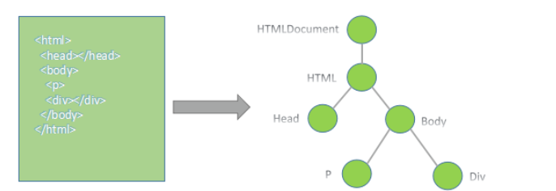
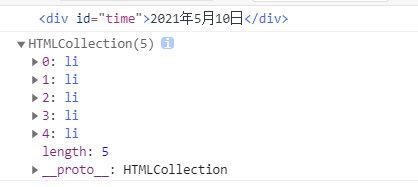
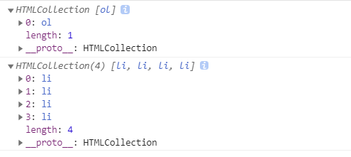

# JavaScript 其三

> 提要
>
> 前面学习的是 ECMAScript 标准规定的基本语法，为本部分 WebAPIs 阶段学习打基础
>
> WebAPIs 阶段主要学习 DOM 和 BOM，实现页面交互功能

## API 的定义

API：应用程序编程接口，是一种预先定义的函数

Web API：**浏览器提供**的一套操作浏览器功能和页面元素的 API（BOM 和 DOM），很多都是方法/函数

MDN 给出了常用的 API 接口，具体可以根据需求查询

## 文档对象模型（DOM）

> W3C 推荐的处理 HTML 文档的标准编程接口
>
> 利用这些接口可以改变页面的结构和样式

HTML 可以划分成为一个 DOM 树形结构



- **文档：一个页面就是一个文档，DOM 中用 document 表示**
- **元素：页面中的所有标签都是元素，DOM 中用 element 表示**
- **节点：网页中的所有内容都是节点，DOM 中用 node 表示**

DOM**把以上的内容都看作对象，有对应的属性和方法**

例如`<a href="www.baidu.com">百度</a>`href 和文本就是节点

## Document 对象

> 因为文档页面从上往下加载，所以 script 的标签要暂时写在下面，后面会有相应的处理方式

### getElementById

注意 ID 是大小写敏感的

使用 getElementById() 方法可以获取带有 ID 的元素对象

`console.dir()`可以打印返回的元素对象，更好的查看里面的属性和方法

```html
<!DOCTYPE html>
<html lang="en">
	<head>
		<title>Document</title>
	</head>
	<body>
		<div id="time">2021年5月10日</div>
		<script>
			let timer = document.getElementById("time");
			console.log(timer);
		</script>
	</body>
</html>
```

### getElementsByTagName

#### 所有标签获取：document 作为对象

使用 getElementsByTagName() 方法可以返回带有指定标签名的对象的集合。

`document.getElementsByTagName('标签名');`

```html
<body>
	<li>Hello World</li>
	<li>Hello World</li>
	<li>Hello World</li>
	<li>Hello World</li>
	<li>Hello World</li>
	<script>
		let list = document.getElementsByTagName("li");
		console.log(list);
	</script>
</body>
```

注意：

1. 因为得到的是一个对象的集合，以伪数组的形式存储，没有 pop、push 等方法，但是有一般数组的长度，并且可以进行类似数组的遍历，所以我们想要操作里面的元素就需要遍历。
2. 得到元素对象是动态的



#### 子元素选择：element 作为对象

这里注意：父元素必须是单个对象（**必须指明是哪个元素对象**），获取的时候不包括父元素自己

```js
element.getElementsByTagName("标签名");
```

```html
<body>
	<ul>
		<li>一</li>
		<li>二</li>
		<li>三</li>
		<li>四</li>
	</ul>
	<ol id="list">
		<li>1</li>
		<li>2</li>
		<li>3</li>
		<li>4</li>
	</ol>
	<script>
		let ol = document.getElementsByTagName("ol");
		let ol_li = ol[0].getElementsByTagName("li");
		console.log(ol);
		console.log(ol_li);
		//或者采用以下方法也可以选中
		let ol = document.getElementsById("list");
		let ol_li = ol.getElementsByTagName("li");
	</script>
</body>
```



### H5 新增获取的元素方式

1. document.querySelector('选择器'); // 根据指定选择器返回第一个元素对象

   1. 可以是任何的选择器，**但选择器必须加符号**
      1. 标签选择器
      2. 类选择器
      3. 标签选择器

2. document.getElementsByClassName(‘类名’)；// 根据类名返回元素对象集合

3. document.querySelectorAll('选择器'); // 根据指定选择器返回，返回所有元素的集合
   1. 要求和第一个方法相同

### 获取特殊元素

- 获取 body 元素

```js
document.body;
```

- 获取 html 元素

```
document.documentElement
```

## 事件

JavaScript 使我们有能力创建动态页面，而事件是可以被 JavaScript 侦测到的行为。

简单理解： 触发--- 响应机制。

**网页中的每个元素都可以产生某些可以触发 JavaScript 的事件**，例如，我们可以在用户点击某按钮时产生一个事件，然后去执行某些操作。

### 事件三要素

#### 事件源

事件被触发的对象，通常利用 document 对象中的 getElementBy……进行获取

#### 事件类型

如何触发，例如鼠标点击等操作

#### 事件处理程序

通过函数赋值的方式来完成

```html
<body>
	<button id="btn">Hello</button>
	<script>
		let btn = document.getElementById("btn"); //获得事件源
		btn.onclick = function () {
			alert("Hello!");
		};
	</script>
</body>
```

### 执行事件的步骤

1. 获取事件源
2. 注册事件（绑定事件）
3. 添加事件处理程序（采取函数赋值形式）

### 操作元素

#### 改变元素的内容

